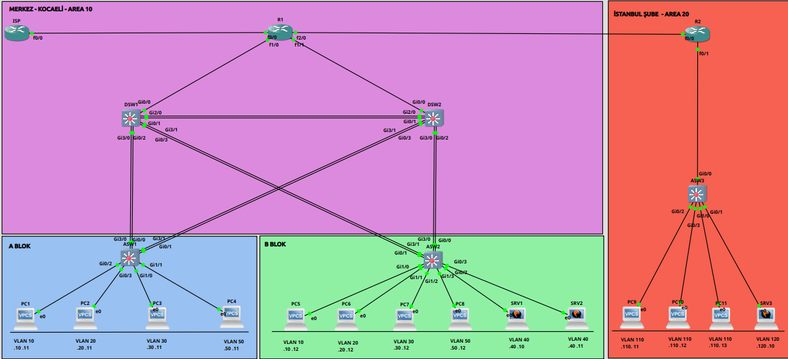

# Yedekli Kurumsal Kampüs Ağı — Kocaeli Merkez + İstanbul Şube

İki lokasyonlu bir kurumun ağı: 9 ağ cihazı, 14 host, 7 VLAN. Dağıtım katmanı yedekli
kurulmuş, yedekliliğin gerçekten çalıştığı ölçülerek kanıtlanmış.

**Ortam:** GNS3 · Cisco IOSvL2 15.2 (×5) · Cisco 7206VXR IOS 15.3 · Cisco 3745 IOS 12.4 ·
Cisco 2691 IOS 12.4 · VPCS (×13) · Ubuntu Server (×1)



---

## Ne yapıldı

| Katman | Teknoloji |
|---|---|
| Erişim | 7 VLAN, 802.1Q trunk, native VLAN 999, port security, BPDU Guard, PortFast |
| Dağıtım | SVI, **HSRPv2** (aktif rol VLAN'lara bölünmüş), **LACP EtherChannel** (5 bundle), **Rapid-PVST+**, Root Guard |
| Çekirdek | **Çok alanlı OSPFv2** (area 0 / 10 / 20), iki ABR |
| Servis | Merkezî DHCP + `ip helper-address` relay, **NAT/PAT** |
| Güvenlik | Extended ACL (IP ve port bazlı), SSHv2-only yönetim, errdisable recovery |

---

## Tasarım kararları

**İki dağıtım switch'i de çalışıyor, biri boşta beklemiyor.** HSRP aktif rolü VLAN'lara
bölündü — DSW1 VLAN 10/30/50'de aktif, DSW2 VLAN 20/40'ta. Rapid-PVST+ kök köprü dağılımı
aynı şekilde yapıldı, böylece bir VLAN'ın L2 ve L3 yolu aynı cihazdan geçiyor.

```
DSW1: spanning-tree vlan 10,30,50 root primary   (priority 24586)
      spanning-tree vlan 20,40    root secondary
DSW2: spanning-tree vlan 20,40    root primary   (priority 24596)
      spanning-tree vlan 10,30,50 root secondary
```

**Her erişim switch'i iki dağıtım switch'ine ikişer kabloyla bağlı.** Bu bilerek bir L2
döngüsü yaratıyor; Rapid-PVST+ bir bundle'ı `Altn BLK` durumuna alıyor. Yedekliliğin
varlık sebebi bu blok — T5 testinde devreye girdiğini ölçtük.

**Yönlendirme asimetrik.** İç cihazlar varsayılan rotayı OSPF'ten öğreniyor
(`default-information originate`), kenar router iç ağları biliyor. Kenar cihaz iç
topolojiyi bilir, iç cihaz dış dünyayı bilmek zorunda değildir.

**Şubede HSRP yok.** Tek router, router-on-a-stick. Yedeklilik maliyetli; şubenin
kritikliği merkezinkiyle aynı değil. Bilinçli bir tercih.

**Sunucular statik, kullanıcılar DHCP.** Misafir VLAN'ı 4 saat, diğerleri 8 saat kira.
İlk 20 adres her havuzda rezerve (`excluded-address`).

**Port security `restrict`, `shutdown` değil.** İhlal eden çerçeve düşürülüyor, port
kapanmıyor. `shutdown` modunda ihlali yapan tek cihaz yüzünden o portu paylaşan herkes
kesilir — T2 testinde bunu da gösterdik.

---

## Adresleme

### Merkez — Kocaeli (Area 10)

| VLAN | Ad | Ağ | HSRP VIP | DSW1 | DSW2 | Aktif |
|---|---|---|---|---|---|---|
| 10 | YONETIM | 172.16.10.0/24 | .1 | .2 | .3 | DSW1 |
| 20 | MUHASEBE | 172.16.20.0/24 | .1 | .2 | .3 | DSW2 |
| 30 | SATIS | 172.16.30.0/24 | .1 | .2 | .3 | DSW1 |
| 40 | IT-SUNUCU | 172.16.40.0/24 | .1 | .2 | .3 | DSW2 |
| 50 | MISAFIR | 172.16.50.0/24 | .1 | .2 | .3 | DSW1 |
| 999 | NATIVE-KULLANILMIYOR | — | — | — | — | — |

### Şube — İstanbul (Area 20)

| VLAN | Ad | Ağ | Gateway |
|---|---|---|---|
| 110 | SUBE-KULLANICI | 172.16.110.0/24 | 172.16.110.1 (R2 Fa0/1.110) |
| 120 | SUBE-SUNUCU | 172.16.120.0/24 | 172.16.120.1 (R2 Fa0/1.120) |

### Transit

| Ağ | Hat | Adresler | OSPF alanı |
|---|---|---|---|
| 10.1.0.0/30 | R1 Fa1/0 ↔ DSW1 Gi0/0 | .1 / .2 | 10 |
| 10.1.0.4/30 | R1 Fa1/1 ↔ DSW2 Gi0/0 | .5 / .6 | 10 |
| 10.1.0.8/30 | R1 Fa2/0 ↔ R2 Fa0/0 | .9 / .10 | 0 |
| 203.0.113.0/30 | R1 Fa0/0 ↔ ISP Fa0/0 | .2 / .1 | — (NAT sınırı) |

### EtherChannel

| Bundle | Uçlar | Portlar |
|---|---|---|
| Po1 | DSW1 ↔ DSW2 | Gi0/1, Gi2/0 (her iki uçta) |
| Po10 | DSW1 ↔ ASW1 | DSW1: Gi0/2, Gi3/0 · ASW1: Gi0/0, Gi3/0 |
| Po11 | DSW2 ↔ ASW1 | DSW2: Gi0/3, Gi3/1 · ASW1: Gi0/1, Gi3/1 |
| Po20 | DSW1 ↔ ASW2 | DSW1: Gi0/3, Gi3/1 · ASW2: Gi0/1, Gi3/1 |
| Po21 | DSW2 ↔ ASW2 | DSW2: Gi0/2, Gi3/0 · ASW2: Gi0/0, Gi3/0 |

### OSPF

| Cihaz | Router-ID | Alan(lar) | Rol |
|---|---|---|---|
| DSW1 | 1.1.1.1 | 10 | İç router |
| DSW2 | 2.2.2.2 | 10 | İç router |
| R1 | 3.3.3.3 | 0, 10 | **ABR** + NAT + DHCP sunucusu |
| R2 | 4.4.4.4 | 0, 20 | **ABR** |

Kullanıcı SVI'ları `passive-interface` — o arayüzlerden hello gitmiyor, ama ağlar
duyuruluyor.

---

## Testler ve ölçümler

Tam çıktılar `Testler/` ve `Verification/` klasörlerinde.

### T1 — Extended ACL

Misafir VLAN'ı iç kaynaklara erişemez, internete çıkabilir.

| Test | Sonuç |
|---|---|
| PC4 (misafir) → 172.16.40.10 (sunucu) | engellendi |
| PC4 → 172.16.10.11 (başka VLAN) | engellendi |
| PC4 → 10.1.0.1 (router arayüzü) | engellendi |
| PC4 → 8.8.8.8 (internet) | geçti |
| PC1 (yönetim) → 172.16.40.10 | geçti |
| PC8 → DHCP | adres aldı |

Engellenen ping'lerde dönen cevap sessiz bir zaman aşımı değil:

```
*172.16.50.2 icmp_seq=1 ttl=255 (ICMP type:3, code:13, Communication administratively prohibited)
```

**Code 13** = yönetici tarafından engellendi. ACL'in paketi düşürdüğünün doğrudan kanıtı.

Sayaçlar:

```
Extended IP access list MISAFIR-KISIT
    10 permit udp any any eq bootps (6 matches)
    30 deny ip 172.16.50.0 0.0.0.255 172.16.0.0 0.0.255.255 (20 matches)
    40 deny ip 172.16.50.0 0.0.0.255 10.1.0.0 0.0.255.255 (10 matches)
    50 permit ip 172.16.50.0 0.0.0.255 any (4365 matches)
```

### T1b — Port bazlı filtreleme

Satış VLAN'ı sunucuya ping atabilir, HTTP ile erişemez. Aynı kaynak, aynı hedef,
**farklı port → farklı sonuç**:

| Komut | Protokol/Port | Sonuç |
|---|---|---|
| `ping 172.16.40.10` | ICMP | geçti |
| `ping 172.16.40.10 -P 6 -p 80` | TCP/80 | `code:13` |
| `ping 172.16.40.10 -P 6 -p 22` | TCP/22 | geçti |

```
Extended IP access list SATIS-KISIT
    10 deny tcp 172.16.30.0 0.0.0.255 host 172.16.40.10 eq www (3 matches)
    20 permit ip 172.16.30.0 0.0.0.255 any (91 matches)
```

Standart ACL bunu yapamaz; extended'ın varlık sebebi tam olarak bu ayrım.

### T2 — Port security ihlali

ASW1 `Gi0/3`'te `maximum 1`. Araya hub konulup ikinci bir host bağlandı.

```
Port Status                : Secure-up
Violation Mode             : Restrict
Maximum MAC Addresses      : 1
Total MAC Addresses        : 1
Last Source Address:Vlan   : 0050.7966.680b:20
Security Violation Count   : 7
```

Yetkisiz host hiç adres çözümleyemedi:

```
ROGUE> ping 172.16.20.1
host (172.16.20.1) not reachable
```

MAC tablosunda yalnızca meşru host var — ihlal eden MAC hiç öğrenilmedi, port security
öğrenmeden önce reddetti.

### T3 — BPDU Guard

ASW1'in erişim portuna geçici bir switch bağlandı.

```
%SPANTREE-2-BLOCK_BPDUGUARD: Received BPDU on port GigabitEthernet1/2 with BPDU Guard
                             enabled. Disabling port.
%PM-4-ERR_DISABLE: bpduguard error detected on Gi1/2, putting Gi1/2 in err-disable state
```

```
Port      Status       Reason
Gi1/2     err-disabled bpduguard
```

Otomatik kurtarma da çalışıyor:

```
Interface       Errdisable reason       Time left(sec)
Gi1/2                  bpduguard          171
```

### T4 — HSRP devralması 

PC1'den saniyede bir ping atılırken DSW1 durduruldu.

| Olay | Kayıp paket | Süre |
|---|---|---|
| **DSW1 çöktü** | 10 | ~10 sn |
| **DSW1 geri geldi** | 12 | ~12 sn |

İlk sayı HSRP'nin varsayılan **hold timer**'ı (10 sn): aktif router veda mesajı
göndermeden kaybolunca yedek 10 saniye bekler.

İkinci sayı daha ilginç — **geri dönüş, çökmekten pahalı.** DSW1 açılırken `preempt`
hemen devreye giriyor ("önceliğim 110, devralıyorum") ama o anda Po10 bundle'ı LACP
pazarlığını bitirmemiş, STP geçiş aşamasında, OSPF komşuluğu kurulmamış. Trafik
üstleniliyor ama taşıyacak yol henüz hazır değil.

Devralma logları:

```
15:18:51  Vlan30  Listen -> Active
15:18:52  Vlan10  Listen -> Active
15:18:53  Vlan50  Listen -> Active
15:19:14  Vlan20  Speak  -> Standby
15:19:14  Vlan40  Speak  -> Standby
```

İlk üç grup `Listen`'dan **doğrudan** `Active`'e atladı — normal sıra
Listen → Speak → Standby → Active'dir. Ara durumları atlamaları `preempt`'in ve 110
önceliğinin sonucu. `preempt` yazılmasaydı DSW1 geri gelse bile yedek kalır ve yük
dağılımı kalıcı olarak bozulurdu.

### T5 — STP yeniden yakınsaması

DSW1 kapalıyken ASW1'de:

```
Interface           Role Sts Cost      Prio.Nbr Type
Gi0/2               Desg FWD 4         128.3    P2p Edge
Po11                Root FWD 3         128.66   P2p
```

Normal durumda `Po11` **`Altn BLK`** idi; DSW1 düşünce `Root FWD` oldu ve kök köprü
DSW2'ye geçti (`Priority 28682` = 28672 + 10, yani `root secondary`).

---

## Karşılaşılan sorunlar

### 1. R2'nin OSPF maliyetleri bozuktu

`show ip route ospf` çıktısında şube ağları beklenenden pahalı görünüyordu:

```
O IA  10.1.0.8/30      [110/2]
O IA  172.16.110.0/24  [110/12]     ← +10 fazla
```

Aynı fiziksel hattın iki ucu farklı maliyet raporluyordu: R1 `Fa2/0` → 1, R2 `Fa0/0` → 10.
Sebep, 3745'in arayüzlerinin bant genişliğini 10 Mbps olarak bildirmesiydi. OSPF maliyeti
`referans / arayüz bant genişliği` olduğu için değer on katına çıkıyordu.

```
interface FastEthernet0/0
 bandwidth 100000
```

Alt arayüzlere **ayrıca** yazmak gerekti; fizikselden miras alınmadı. Düzeltme sonrası
tüm maliyetler 1'e indi.

### 2. ACL, DHCP'yi öldürecekti

İlk taslakta ACL yalnızca `172.16.50.0/24` kaynağını tanıyordu. Oysa DHCP Discover
paketinin kaynağı `0.0.0.0`, hedefi `255.255.255.255` — hiçbir satıra uymuyor ve gizli
`deny any any` tarafından siliniyordu. Yani **adresi olan istemci çalışır, kirasını
yenilemeye çalışan istemci ağdan düşerdi.**

```
permit udp any any eq 67
permit udp any any eq 68
```

Bu iki satır listenin başına eklendi. Üretimde "misafir ağı sabaha karşı çöküyor"
şikâyetinin klasik sebebi budur.

### 3. HSRP zamanlayıcı ayarı geri alındı

Kesintiyi 10 saniyeden 1 saniyenin altına indirmek için `standby timers msec 250 msec 750`
denendi. Uygulama sonrası gruplar kararsızlaştı ve gateway erişilemez oldu; değişiklik
geri alınıp varsayılanlara dönüldü.

HSRP'de hello/hold değerleri hello paketinin içinde taşınır, iki uçta farklı değerler
olması grupları `Speak`/`Init` durumunda bırakır. Deneme, ayarın **her iki switch'te
eşzamanlı ve tam** uygulanması gerektiğini gösterdi. Ölçüm varsayılan değerlerle
raporlandı.

### 4. Emülatör link durumunu iletmiyor

DSW1 node'u durdurulduğunda ASW1 kabloyu hâlâ "up" görüyordu; BPDU'lar kesildiği için STP
ancak max-age (20 sn) dolduktan sonra tepki verdi. Gerçek donanımda güç kaybı linki
fiziksel olarak düşürür ve Rapid-PVST+ saniyeler içinde yakınsar. Ölçülen süre tasarımın
değil, ortamın sınırı.

---

## İyileştirme önerileri

Bu kurulumda uygulanmadı, ama tespit edildi:

**`standby preempt delay minimum 180`** — T4'teki ikinci kesintiyi (12 sn) ortadan
kaldırır. Geri dönen cihaz LACP, STP ve OSPF yakınsamasını bekler, ancak sonra rolü alır.

**HSRP zamanlayıcıları (250/750 ms)** — kesintiyi saniyenin altına indirir. Bedeli daha
sık hello ve artan kontrol trafiğidir; yüzlerce SVI'lı ortamlarda tartışılır.

**`auto-cost reference-bandwidth 1000`** — varsayılan 100 Mbps referansla Gigabit ve
FastEthernet aynı maliyeti (1) alıyor, OSPF hızlı ile yavaş hattı ayırt edemiyor. Tüm
OSPF router'larında aynı değer olmak kaydıyla uygulanmalı.

**`ip ospf network point-to-point`** — `/30` Ethernet hatlarda gereksiz DR/BDR seçimini
kaldırır, komşuluk kurulumunu hızlandırır.

---

## Klasör yapısı

```
├── README.md
├── topology/        Topoloji şeması (PNG + SVG)
├── configs/         Dokuz cihazın running-config'i (parolalar redakte edilmiş)
├── verification/    Katman katman doğrulama çıktıları
├── tests/           T1–T5 test çıktıları
└── screenshots/     Numaralı ekran görüntüleri
```

### Ekran görüntüleri

| Dosya | İçerik |
|---|---|
| `00-kampus-topoloji-sema.png` | Topoloji şeması |
| `01-gns3-topoloji-genel.png` | GNS3 tuvali, tüm bölgeler |
| `02-gns3-topoloji-a-blok.png` | A Blok yakın plan |
| `03-etherchannel-summary-tum-switchler.png` | Beş bundle, dört switch bir arada |
| `04-etherchannel-stp-asw1.png` | ASW1 bundle + STP durumu |
| `05-stp-vlan-yuk-dengeleme-asw1.png` | VLAN 10 ve 20'de rollerin ters olması |
| `06-stp-vlan10-baslangic-asw1.png` | Failover öncesi referans: `Po11 Altn BLK` |
| `07-ospf-neighbor-r1.png` | Üç komşu `FULL`, iki alan |
| `08-hsrp-standby-brief.png` | DSW1/DSW2 aktif-yedek dağılımı |
| `09-hsrp-statechange-log-dsw2.png` | Durum geçiş kayıtları |
| `10-nat-pat-config-r1.png` | NAT yapılandırması ve istatistikler |
| `11-nat-pat-port-cakismasi-r1.png` | **PAT port yeniden eşlemesi** |
| `12-ssh-acik-telnet-reddedildi.png` | Telnet reddi + SSH girişi yan yana |
| `13-port-security-hub-duzenegi.png` | Test düzeneği |
| `14-port-security-pc2-hub-arkasinda.png` | İkinci MAC'in porta sokulması |
| `15-port-security-rogue-engellendi.png` | Yetkisiz host ağa giremedi |
| `16-port-security-ihlal-sayaci-asw1.png` | İhlal sayacı ve sticky MAC'ler |
| `17-port-security-eski-haline-donus.png` | Test sonrası geri alma |
| `18-bpduguard-rogue-switch-duzenegi.png` | Sahte switch bağlantısı |
| `19-bpduguard-errdisable-asw1.png` | **Port `err-disabled`, log kayıtlarıyla** |
| `20-errdisable-recovery-asw1.png` | Otomatik kurtarma geri sayımı |
| `21-acl-misafir-vlan50-pc4.png` | Misafir izolasyonu, internet açık |
| `22-acl-port-bazli-filtreleme-pc3.png` | **Aynı hedef, farklı port, farklı sonuç** |
| `23-stp-failover-vlan10-asw1.png` | `Altn BLK` → `Root FWD` geçişi |

---

## Labı yeniden kurmak

`configs/` altındaki dosyalar düz IOS konfigürasyonlarıdır. GNS3'te topolojiyi şemadaki
gibi kurup konsollara yapıştırmak yeterli.

Depoda **IOS imajı veya `.gns3project` dosyası yoktur** — Cisco IOS imajları Cisco'nun
lisansına tabidir ve dağıtılamaz. İmajların kendi lisanslı kaynağından temin edilmesi
gerekir.

Konfigürasyonlardaki parola ve hash değerleri `<REDACTED>` ile değiştirilmiştir.
